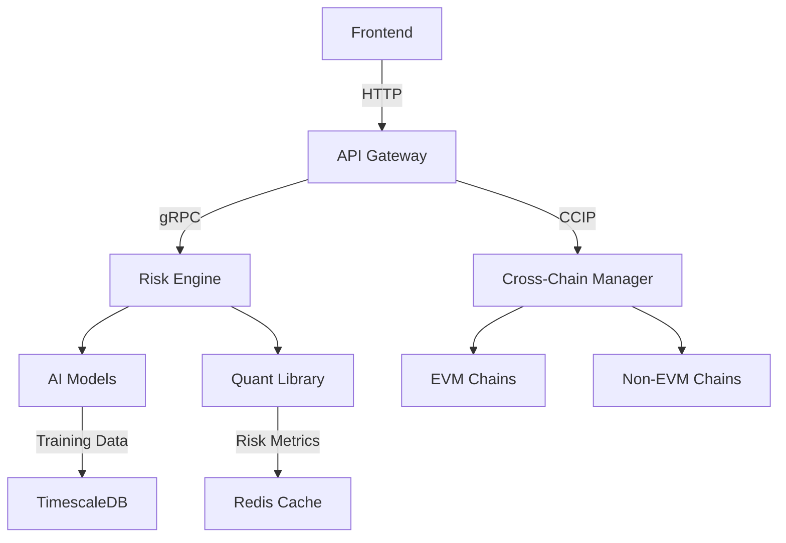

# Cross-Chain Asset Management Protocol (ChainFinity)  
[](https://opensource.org/licenses/MIT)  

## 🌐 Overview  
ChainFinity enables secure cross-chain asset management with AI-powered risk assessment and institutional-grade portfolio analytics. Combines multi-chain interoperability with quantitative finance models for professional asset allocation.

> **Note**: This Project is currently under active development. Features and functionalities are being added and improved continuously to enhance user experience.

## 🚀 Key Features  
- Cross-chain asset transfers (EVM + non-EVM chains)  
- AI-driven correlation forecasting (30+ assets)  
- Dynamic portfolio rebalancing engine  
- Chainlink CCIP-powered messaging  
- GPU-accelerated risk calculations  
- Multi-sig governance with Gnosis Safe  
- Real-time liquidity monitoring  
- Stress testing scenarios  
- The Graph-powered analytics  
- Kubernetes-native architecture  

## 🛠️ Tech Stack  
**Blockchain**: Solidity 0.8, Chainlink CCIP, Hardhat, The Graph  
**Backend**: FastAPI, NumPy, SciPy, Pandas  
**AI/ML**: TensorFlow 2.12, LSTM Networks, Prophet  
**Frontend**: React 18, Recharts, Ethers.js 6  
**Database**: TimescaleDB, Redis  
**Infra**: Kubernetes, Terraform, AWS EKS, ArgoCD  

## 🏗️ Architecture  


## ⚙️ Installation  
```bash
# Clone repository  
git clone https://github.com/abrar2030/ChainFinity.git
cd ChainFinity  

# Install dependencies  
cd blockchain && npm install  
cd ../backend && pip install -r requirements.txt  
cd ../frontend && npm install  

# Configure environment  
cp .env.example .env  
# Add your API keys and chain configurations  

# Start services  
docker-compose -f infrastructure/docker-compose.prod.yml up -d  
cd blockchain && npx hardhat node  
cd ../backend && uvicorn app:app --reload  
cd ../frontend && npm start  
```

## 🚢 Deployment  
```bash
# 1. Train AI models  
python ai_models/train_correlation_model.py --data ./market_data.csv  

# 2. Deploy contracts  
npx hardhat deploy --network arbitrum --tags CrossChainManager  

# 3. Deploy subgraph  
graph deploy --node https://api.thegraph.com/deploy/ ccamp  

# 4. Apply infrastructure  
cd infrastructure/terraform  
terraform init && terraform apply -auto-approve  

# 5. Monitor cluster  
kubectl apply -f k8s/risk-engine-deployment.yaml  
```

## 📄 License  
Distributed under MIT License - See LICENSE for details  