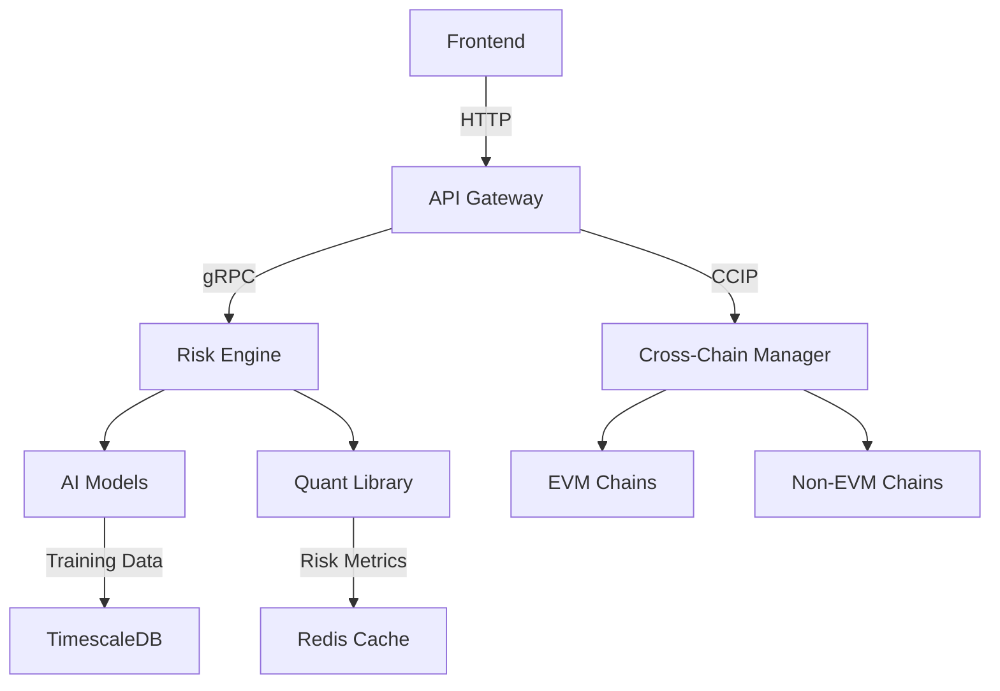

# ChainFinity Project

[](https://github.com/abrar2030/ChainFinity/actions)
[](https://codecov.io/gh/abrar2030/ChainFinity)
[](https://opensource.org/licenses/MIT)

## Overview

ChainFinity enables secure cross-chain asset management with AI-powered risk assessment and institutional-grade portfolio analytics. It combines multi-chain interoperability with quantitative finance models for professional asset allocation.

<div align="center">
  
</div>

> **Note**: This Project is currently under active development. Features and functionalities are being added and improved continuously to enhance user experience.

## Table of Contents
- [Key Features](#-key-features)
- [Feature Implementation Status](#feature-implementation-status)
- [Tech Stack](#-tech-stack)
- [Architecture](#-architecture)
- [Installation](#-installation)
- [Deployment](#-deployment)
- [Testing](#testing)
- [CI/CD Pipeline](#cicd-pipeline)
- [Contributing](#-contributing)
- [License](#-license)

## 🚀 Key Features
- Cross-chain asset transfers (EVM + non-EVM chains)
- AI-driven correlation forecasting (30+ assets)
- Dynamic portfolio rebalancing engine
- Chainlink CCIP-powered messaging
- GPU-accelerated risk calculations
- Multi-sig governance with Gnosis Safe
- Real-time liquidity monitoring
- Stress testing scenarios
- The Graph-powered analytics
- Kubernetes-native architecture

## Feature Implementation Status

| Feature | Status | Description | Planned Release |
|---------|--------|-------------|----------------|
| **Cross-Chain Functionality** |
| EVM Chain Support | ✅ Implemented | Ethereum, Polygon, Arbitrum, etc. | v1.0 |
| Non-EVM Chain Support | ✅ Implemented | Solana, Cosmos, Polkadot | v1.0 |
| Chainlink CCIP Integration | ✅ Implemented | Cross-chain interoperability protocol | v1.0 |
| Cross-Chain Messaging | ✅ Implemented | Inter-blockchain communication | v1.0 |
| Cross-Chain Swaps | 🔄 In Progress | Direct asset swaps between chains | v1.1 |
| Unified Liquidity Pools | 📅 Planned | Cross-chain liquidity aggregation | v1.2 |
| **AI and Risk Management** |
| Correlation Forecasting | ✅ Implemented | AI models for asset correlation | v1.0 |
| Portfolio Rebalancing | ✅ Implemented | Dynamic asset allocation | v1.0 |
| GPU Risk Calculations | ✅ Implemented | Accelerated risk metrics | v1.0 |
| Stress Testing | 🔄 In Progress | Portfolio resilience scenarios | v1.1 |
| Anomaly Detection | 🔄 In Progress | Unusual market behavior alerts | v1.1 |
| Predictive Analytics | 📅 Planned | Future market condition forecasting | v1.2 |
| **Governance and Security** |
| Multi-sig Governance | ✅ Implemented | Gnosis Safe integration | v1.0 |
| Role-based Access | ✅ Implemented | Granular permission system | v1.0 |
| Audit Logging | ✅ Implemented | Comprehensive activity tracking | v1.0 |
| DAO Integration | 🔄 In Progress | Decentralized governance | v1.1 |
| Formal Verification | 📅 Planned | Mathematical contract verification | v1.2 |
| **Monitoring and Analytics** |
| Liquidity Monitoring | ✅ Implemented | Real-time liquidity tracking | v1.0 |
| The Graph Integration | ✅ Implemented | Indexed blockchain data | v1.0 |
| Performance Dashboards | ✅ Implemented | Analytics visualization | v1.0 |
| Custom Reporting | 🔄 In Progress | User-defined analytics | v1.1 |
| ML-powered Insights | 📅 Planned | Advanced data interpretation | v1.2 |
| **Infrastructure** |
| Kubernetes Deployment | ✅ Implemented | Container orchestration | v1.0 |
| Terraform Configuration | ✅ Implemented | Infrastructure as code | v1.0 |
| ArgoCD Integration | ✅ Implemented | GitOps deployment | v1.0 |
| Multi-region Support | 🔄 In Progress | Global infrastructure | v1.1 |
| Auto-scaling | 📅 Planned | Dynamic resource allocation | v1.2 |

**Legend:**
- ✅ Implemented: Feature is complete and available
- 🔄 In Progress: Feature is currently being developed
- 📅 Planned: Feature is planned for future release

## 🛠️ Tech Stack
**Blockchain**: Solidity 0.8, Chainlink CCIP, Hardhat, The Graph  
**Backend**: FastAPI, NumPy, SciPy, Pandas  
**AI/ML**: TensorFlow 2.12, LSTM Networks, Prophet  
**Frontend**: React 18, Recharts, Ethers.js 6  
**Database**: TimescaleDB, Redis  
**Infra**: Kubernetes, Terraform, AWS EKS, ArgoCD  

## 🏗️ Architecture


## ⚙️ Installation
```bash
# Clone repository  
git clone https://github.com/abrar2030/ChainFinity.git
cd ChainFinity  

# Install dependencies  
cd blockchain && npm install  
cd ../backend && pip install -r requirements.txt  
cd ../frontend && npm install  

# Configure environment  
cp .env.example .env  
# Add your API keys and chain configurations  

# Start services  
docker-compose -f infrastructure/docker-compose.prod.yml up -d  
cd blockchain && npx hardhat node  
cd ../backend && uvicorn app:app --reload  
cd ../frontend && npm start  
```

## 🚢 Deployment
```bash
# 1. Train AI models  
python ai_models/train_correlation_model.py --data ./market_data.csv  

# 2. Deploy contracts  
npx hardhat deploy --network arbitrum --tags CrossChainManager  

# 3. Deploy subgraph  
graph deploy --node https://api.thegraph.com/deploy/ ccamp  

# 4. Apply infrastructure  
cd infrastructure/terraform  
terraform init && terraform apply -auto-approve  

# 5. Monitor cluster  
kubectl apply -f k8s/risk-engine-deployment.yaml  
```

## Testing

The project includes comprehensive testing to ensure reliability and security:

### Smart Contract Testing
- Unit tests for contract functions using Hardhat
- Integration tests for cross-chain interactions
- Security audits with Slither and MythX
- Formal verification for critical components

### AI Model Testing
- Model validation with cross-validation
- Backtesting against historical market data
- Performance metrics evaluation
- Stress testing with extreme market scenarios

### Backend Testing
- Unit tests with pytest
- API integration tests
- Performance benchmarks
- Load testing with Locust

### Frontend Testing
- Component tests with React Testing Library
- End-to-end tests with Cypress
- Visual regression tests with Percy

To run tests:

```bash
# Smart contract tests
cd blockchain
npx hardhat test

# AI model tests
cd ai_models
pytest

# Backend tests
cd backend
pytest

# Frontend tests
cd frontend
npm test

# End-to-end tests
cd e2e
npm test
```

## CI/CD Pipeline

ChainFinity uses GitHub Actions for continuous integration and deployment:

### Continuous Integration
- Automated testing on each pull request and push to main
- Code quality checks with ESLint, Prettier, and Pylint
- Test coverage reporting
- Security scanning for vulnerabilities
- Smart contract verification

### Continuous Deployment
- Automated deployment to staging environment on merge to main
- Manual promotion to production after approval
- Docker image building and publishing
- Kubernetes deployment via ArgoCD
- Infrastructure updates via Terraform

Current CI/CD Status:
- Build: 
- Test Coverage: 
- Smart Contract Audit: 

## 🤝 Contributing

We welcome contributions to improve ChainFinity! Here's how you can contribute:

1. **Fork the repository**
   - Create your own copy of the project to work on

2. **Create a feature branch**
   - `git checkout -b feature/amazing-feature`
   - Use descriptive branch names that reflect the changes

3. **Make your changes**
   - Follow the coding standards and guidelines
   - Write clean, maintainable, and tested code
   - Update documentation as needed

4. **Commit your changes**
   - `git commit -m 'Add some amazing feature'`
   - Use clear and descriptive commit messages
   - Reference issue numbers when applicable

5. **Push to branch**
   - `git push origin feature/amazing-feature`

6. **Open Pull Request**
   - Provide a clear description of the changes
   - Link to any relevant issues
   - Respond to review comments and make necessary adjustments

### Development Guidelines

- Follow Solidity best practices for smart contracts
- Use ESLint and Prettier for JavaScript/React code
- Follow PEP 8 style guide for Python code
- Write unit tests for new features
- Update documentation for any changes
- Ensure all tests pass before submitting a pull request
- Keep pull requests focused on a single feature or fix

## 📄 License
Distributed under MIT License - See [LICENSE](./LICENSE) for details
